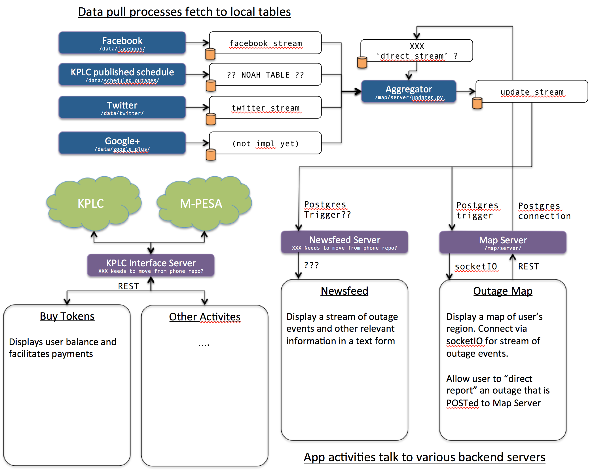

KPLC App Backend
================

This repository holds all of the backend and glue logic for the Kenya Power and
Lighting Company application developed by Lab11.

Architecture
------------

The backend is decomposed into a series of microservices. Cloud processes
aggregrate various outage information to present to the app in a cohesive
manner. The backend also provides a RESTful frontend to KPLC and M-PESA
services.

